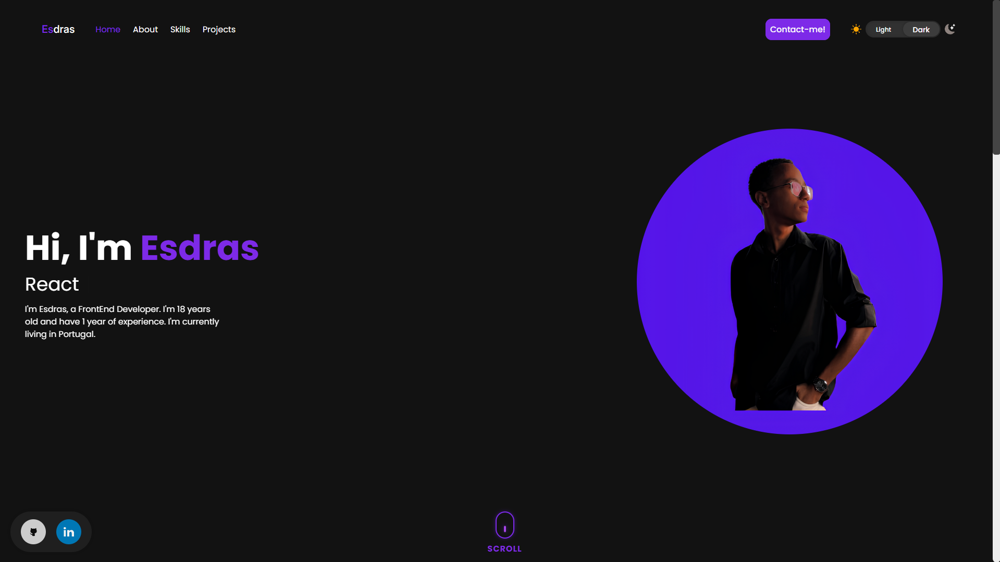
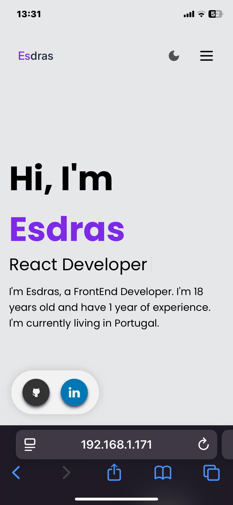

# Esdras's Portfolio

This is my personal portfolio, built with **React**, **Vite**, and **Tailwind CSS**. Visit the website to learn more about my projects, skills, and experiences.

## 🚀 Technologies Used

- **React**: JavaScript library for building user interfaces.
- **Vite**: Build tool for fast development with ES modules.
- **Tailwind CSS**: Utility-first CSS framework for fast and responsive styling.

## 📦 How to Run the Project Locally

1. Clone this repository:

    ```bash
    git clone https://github.com/esdrassantos06/portfolio.git
    ```

2. Navigate to the project folder:

    ```bash
    cd portfolio
    ```

3. Install the dependencies:

    ```bash
    npm i
    ```

4. Start the development server:

    ```bash
    npm run dev
    ```

5. Open the portfolio in your browser:

    ```
    http://localhost:5173
    ```

## 🔧 Features

- Showcases my **projects**, with descriptions and links to live versions.
- **Skills section** highlighting the technologies I’m proficient in.
- **Contact section** with information to get in touch.

## 📸 Screenshots

Here are some screenshots of my portfolio:




## 💬 Feedback

Feel free to send suggestions and feedback. You can open an **issue** or contact me directly.

## 👨‍💻 Developed by Esdras

This portfolio was created to showcase my skills and projects in technology. I’m always learning and growing as a front-end developer.
